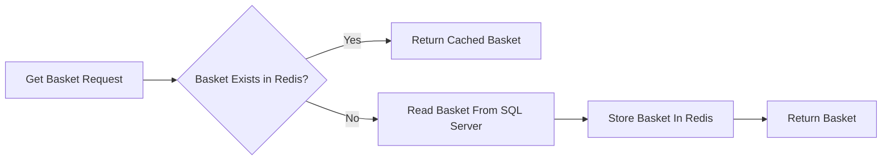
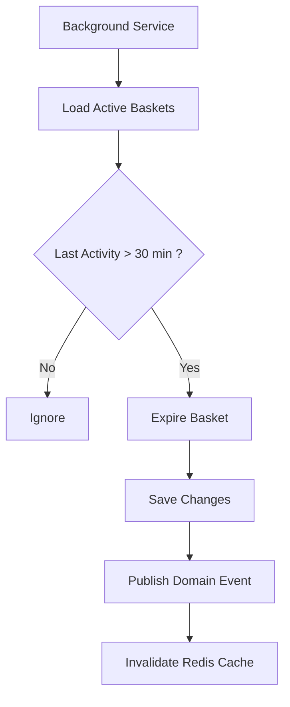
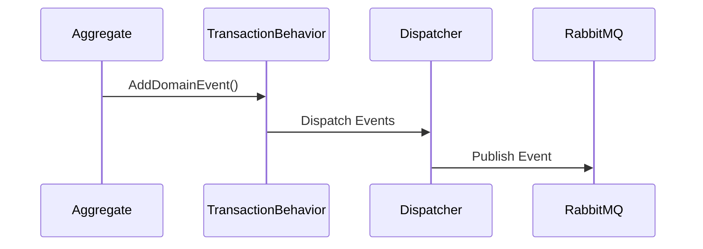
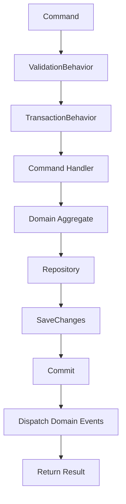

# ماژول مدیریت سبد خرید فروشگاه سیماگر (Basket Management Microservice)

> پروژه ارزیابی فنی جهت استخدام در شرکت **سیماگر**

---

# معرفی پروژه

این پروژه پیاده‌سازی ماژول مدیریت سبد خرید (Basket Management) برای سامانه فروشگاهی سیماگر است که با استفاده از **.NET 8** و بر پایه اصول معماری نرم‌افزار مدرن توسعه داده شده است.

هدف این پروژه، طراحی و پیاده‌سازی یک سرویس مستقل، توسعه‌پذیر، قابل نگهداری و تست‌پذیر برای مدیریت سبد خرید کاربران است؛ به‌گونه‌ای که تمامی قوانین کسب‌وکار در لایه دامنه (Domain Layer) متمرکز شده و اجزای مختلف سیستم دارای کمترین وابستگی ممکن باشند.

در این پروژه علاوه بر پیاده‌سازی نیازمندی‌های مطرح‌شده در مستند تسک، تلاش شده است ساختار پروژه تا حد امکان به استانداردهای رایج در پروژه‌های Enterprise نزدیک باشد.

---

# معماری پروژه

در طراحی این پروژه از ترکیب چندین الگوی شناخته‌شده معماری نرم‌افزار استفاده شده است.

- Clean Architecture
- Domain-Driven Design (DDD)
- CQRS (Command Query Responsibility Segregation)
- Vertical Slice Architecture
- Repository Pattern
- Unit of Work Pattern
- Domain Events
- Pipeline Behaviors
- Dependency Injection

این معماری باعث شده است:

- منطق کسب‌وکار کاملاً از زیرساخت مستقل باشد.
- تست‌پذیری پروژه افزایش یابد.
- توسعه قابلیت‌های جدید با کمترین تغییر در بخش‌های موجود انجام شود.
- وابستگی بین لایه‌های مختلف حداقل باشد.

---

# تکنولوژی‌های استفاده‌شده

| تکنولوژی | کاربرد |
|----------|---------|
| ASP.NET Core 8 | پیاده‌سازی REST API |
| Entity Framework Core 8 | ارتباط با پایگاه داده |
| SQL Server | ذخیره‌سازی اطلاعات |
| Redis | کش سبد خرید |
| RabbitMQ | انتشار رویدادهای دامنه |
| BackgroundService | مدیریت خودکار انقضای سبدها |
| FluentValidation | اعتبارسنجی درخواست‌ها |
| MediatR | پیاده‌سازی CQRS |
| Docker Compose | راه‌اندازی سرویس‌های زیرساخت |
| xUnit | تست واحد |
| Moq | Mock کردن وابستگی‌ها |

---

# قابلیت‌های پیاده‌سازی‌شده

## مدیریت سبد خرید

- دریافت یا ایجاد سبد خرید کاربر
- افزودن کالا به سبد خرید
- بروزرسانی تعداد کالا
- حذف کالا از سبد خرید
- خالی کردن کامل سبد خرید
- مدیریت خودکار انقضای سبدهای غیرفعال

---

## قوانین کسب‌وکار

در این پروژه قوانین اصلی کسب‌وکار مستقیماً در Aggregate مربوط به Basket پیاده‌سازی شده‌اند.

- حداکثر تعداد هر کالا در سبد: **۱۰ عدد**
- حداکثر مبلغ مجاز سبد: **۵۰,۰۰۰,۰۰۰ ریال**
- جلوگیری از انجام عملیات روی سبدهای منقضی‌شده
- جلوگیری از ایجاد وضعیت ناسازگار در موجودیت Basket

---

# ساختار پروژه

```text
src
│
├── Mansari.Store.Basket.API
│
├── Mansari.Store.Basket.Application
│   ├── Basket
│   │   ├── Commands
│   │   ├── Queries
│   │   ├── Events
│   │   └── Behaviors
│   │
│   ├── DTOs
│   ├── Mapping
│   └── Common
│
├── Mansari.Store.Basket.Domain
│   ├── Aggregates
│   ├── Entities
│   ├── Events
│   ├── Enums
│   └── Exceptions
│
└── Mansari.Store.Basket.Infrastructure
    ├── Persistence
    ├── Redis
    ├── Messaging
    ├── BackgroundServices
    └── DependencyInjection
````

ساختار پروژه به گونه‌ای طراحی شده است که هر لایه تنها به لایه‌های مجاز وابسته باشد و تمام منطق تجاری در Domain متمرکز باقی بماند.

```
```
---

# نمای کلی معماری (Architecture Overview)

این پروژه بر اساس الگوی **Clean Architecture** طراحی شده است؛ به‌طوری‌که منطق کسب‌وکار از جزئیات زیرساخت، پایگاه داده و فریمورک مستقل باقی بماند.

درخواست‌های ورودی ابتدا وارد لایه API شده و پس از عبور از Dispatcher و Pipeline Behaviorها به Command یا Query مربوطه هدایت می‌شوند. منطق اصلی سیستم در Aggregate مربوط به Basket اجرا شده و در نهایت داده‌ها توسط Repository در پایگاه داده ذخیره می‌شوند.

```text
                                    Client
                                       │
                                       │ HTTP
                                       ▼
                              BasketController
                                       │
                      ICommandDispatcher / IQueryDispatcher
                                       │
             ┌─────────────────────────┴─────────────────────────┐
             │                                                   │
             ▼                                                   ▼
      Command Handlers                                   Query Handlers
             │                                                   │
             └─────────────────────────┬─────────────────────────┘
                                       │
                               Pipeline Behaviors
                         (Validation / Transaction)
                                       │
                                       ▼
                              Basket Aggregate
                                       │
                                Repository Layer
                                       │
                    ┌──────────────────┴──────────────────┐
                    ▼                                     ▼
              SQL Server                             Redis Cache
                                       │
                                       ▼
                                 Domain Events
                                       │
                                       ▼
                                  RabbitMQ
```

---

# C4 Model

برای نمایش معماری سیستم از مدل **C4 Model** استفاده شده است.

C4 یکی از روش‌های استاندارد مستندسازی معماری نرم‌افزار است که ساختار سیستم را در سطوح مختلف نمایش می‌دهد.

در این پروژه از دو سطح اول C4 استفاده شده است.

---

# C4 Level 1 — System Context

در این سطح ارتباط سرویس Basket با بازیگران و سرویس‌های خارجی نمایش داده می‌شود.

```text
                         +----------------------+
                         |       کاربر          |
                         +----------+-----------+
                                    |
                                    | REST API
                                    |
                                    ▼
      +------------------------------------------------------+
      |          Basket Management Microservice              |
      |------------------------------------------------------|
      |                                                     |
      | مدیریت سبد خرید کاربران                             |
      | اعمال قوانین کسب‌وکار                               |
      | مدیریت کش                                           |
      | مدیریت انقضای سبدها                                 |
      +------------+----------------+------------------------+
                   |                |                |
                   |                |                |
                   ▼                ▼                ▼

            +------------+    +------------+    +-------------+
            | SQL Server |    |   Redis    |    |  RabbitMQ   |
            +------------+    +------------+    +-------------+
```

---

# C4 Level 2 — Container Diagram

این سطح اجزای اصلی داخل میکروسرویس Basket و ارتباط آن‌ها را نمایش می‌دهد.

```text
                        Client
                           │
                           │ HTTP
                           ▼
                  ASP.NET Core Web API
                           │
                           ▼
                  BasketController
                           │
             ICommandDispatcher / IQueryDispatcher
                           │
         ┌─────────────────┴─────────────────┐
         ▼                                   ▼

   Command Side                        Query Side
 (Write Operations)                 (Read Operations)

         │                                   │
         └─────────────────┬─────────────────┘
                           ▼
                  Application Layer
                           │
                           ▼
                   Basket Aggregate
                           │
                           ▼
                     Repository Layer
                           │
          ┌────────────────┴────────────────┐
          ▼                                 ▼

      SQL Server                       Redis Cache

                           │
                           ▼
                     Domain Events
                           │
                           ▼
                  DomainEventDispatcher
                           │
                           ▼
                        RabbitMQ
```

---

# Sequence Diagram

نمودار زیر روند اجرای یکی از مهم‌ترین سناریوهای سیستم، یعنی **افزودن کالا به سبد خرید** را نمایش می‌دهد.

```text
Client
   │
   │ Add Item
   ▼
BasketController
   │
   ▼
Command Dispatcher
   │
   ▼
ValidationBehavior
   │
   ▼
TransactionBehavior
   │
   ▼
AddItemToBasketCommandHandler
   │
   ▼
Basket Aggregate
   │
   ▼
BasketRepository
   │
   ▼
SQL Server
   │
   ▼
Commit Transaction
   │
   ▼
Dispatch Domain Events
   │
   ▼
RabbitMQ Publisher
   │
   ▼
Invalidate Redis Cache
   │
   ▼
Return Success Response
```

> **نکته:** در نسخه گرافیکی این پروژه، همین Sequence Diagram با فرمت Mermaid نیز قابل نمایش است و در صورت استفاده از GitHub به‌صورت خودکار رندر خواهد شد.

در فرآیند فوق، اعتبارسنجی درخواست، اعمال قوانین کسب‌وکار، ثبت تغییرات، انتشار Domain Event و حذف کش Redis همگی به‌ترتیب و در قالب یک تراکنش واحد انجام می‌شوند.
````
---

# راهبرد کش (Redis Caching Strategy)

به‌منظور کاهش بار پایگاه داده و افزایش سرعت پاسخ‌گویی، در این پروژه از الگوی **Cache Aside Pattern** استفاده شده است.

در این الگو ابتدا اطلاعات از Redis خوانده می‌شود و تنها در صورت نبود داده، پایگاه داده مورد پرس‌وجو قرار می‌گیرد.

کلید ذخیره‌سازی اطلاعات سبد خرید به صورت زیر تعریف شده است:

```text
basket:{UserId}
```

جریان اجرای عملیات خواندن سبد خرید به صورت زیر است:



تمامی عملیاتی که باعث تغییر اطلاعات سبد خرید می‌شوند، پس از موفقیت تراکنش، کش مربوط به همان کاربر را حذف می‌کنند تا همواره داده‌های کش با پایگاه داده همگام باقی بمانند.

کش Redis در عملیات‌های زیر به‌صورت خودکار حذف می‌شود:

- افزودن کالا
- بروزرسانی تعداد کالا
- حذف کالا
- خالی کردن سبد خرید
- منقضی شدن سبد خرید

---

# مدیریت انقضای سبد خرید

یکی از نیازمندی‌های اصلی این پروژه، مدیریت خودکار سبدهای خرید غیرفعال است.

برای این منظور از یک **Background Service** استفاده شده است که به‌صورت دوره‌ای اجرا شده و سبدهایی را که بیش از **۳۰ دقیقه** بدون فعالیت باقی مانده‌اند، منقضی می‌کند.

معیار انقضا:

- BasketStatus = Active
- LastUpdatedAt > 30 Minutes

فرآیند اجرای این سرویس به صورت زیر است:



این طراحی باعث می‌شود فرآیند انقضای سبدها از درخواست‌های کاربران مستقل بوده و بدون ایجاد سربار روی API انجام شود.

---

# Domain Events

در این پروژه از **Domain Events** برای جداسازی منطق دامنه از عملیات جانبی (Side Effects) استفاده شده است.

هر زمان وضعیت Aggregate تغییر کند، رویداد مربوطه در Domain ثبت شده و پس از Commit موفق تراکنش منتشر می‌شود.

رویدادهای فعلی پروژه عبارت‌اند از:

| Domain Event | توضیح |
|--------------|-------|
| BasketItemAddedEvent | افزودن کالا به سبد |
| BasketItemUpdatedEvent | تغییر تعداد کالا |
| BasketItemRemovedEvent | حذف کالا |
| BasketClearedEvent | خالی شدن کامل سبد |
| BasketExpiredEvent | منقضی شدن سبد خرید |

فرآیند انتشار رویدادها:



به این ترتیب منطق دامنه از نحوه انتشار رویدادها کاملاً مستقل باقی می‌ماند.

---

# قوانین کسب‌وکار (Business Rules)

تمام قوانین اصلی سیستم در Aggregate مربوط به **Basket** پیاده‌سازی شده‌اند تا از ایجاد وضعیت ناسازگار جلوگیری شود.

قوانین پیاده‌سازی‌شده عبارت‌اند از:

| قانون | مقدار |
|--------|--------|
| حداکثر تعداد هر کالا | ۱۰ عدد |
| حداکثر مبلغ کل سبد | ۵۰,۰۰۰,۰۰۰ ریال |
| جلوگیری از تغییر سبد منقضی‌شده | ✔ |
| جلوگیری از ثبت وضعیت ناسازگار | ✔ |

تمام Commandها قبل از اعمال تغییرات، این قوانین را بررسی می‌کنند.

---

# مدیریت تراکنش‌ها

تمام عملیات نوشتن از طریق **TransactionBehavior** اجرا می‌شوند.

ترتیب اجرای درخواست‌های نوشتنی به شکل زیر است:



این فرآیند تضمین می‌کند که:

- اعتبارسنجی قبل از اجرای منطق انجام شود.
- تمام تغییرات در قالب یک تراکنش واحد ثبت شوند.
- Domain Eventها تنها پس از Commit موفق منتشر شوند.
- در صورت بروز خطا، هیچ تغییری در پایگاه داده ثبت نشود.

---
````
---

# راه‌اندازی پروژه

## پیش‌نیازها

برای اجرای پروژه، ابزارهای زیر باید روی سیستم نصب باشند:

- .NET SDK 8
- Docker Desktop
- SQL Server
- Redis
- RabbitMQ
- Entity Framework Core CLI

در صورت استفاده از Docker Compose، تنها نصب Docker Desktop کافی خواهد بود و سایر سرویس‌ها به‌صورت خودکار راه‌اندازی می‌شوند.

---

# راه‌اندازی زیرساخت

برای اجرای سرویس‌های موردنیاز شامل SQL Server، Redis و RabbitMQ دستور زیر را اجرا کنید:

```bash
docker-compose up -d
```

پس از اجرای موفق، سرویس‌های زیر در دسترس خواهند بود:

| سرویس | کاربرد |
|--------|---------|
| SQL Server | ذخیره اطلاعات سبد خرید |
| Redis | کش اطلاعات |
| RabbitMQ | انتشار رویدادها |

برای بررسی وضعیت سرویس‌ها می‌توانید از دستور زیر استفاده کنید:

```bash
docker ps
```

---

# اعمال Migration

پس از راه‌اندازی زیرساخت، پایگاه داده را با اجرای Migration ایجاد کنید.

```bash
dotnet ef database update \
--project src/Mansari.Store.Basket.Infrastructure \
--startup-project src/Mansari.Store.Basket.API
```

در صورت نیاز به ایجاد Migration جدید:

```bash
dotnet ef migrations add InitialBasketCreate \
--project src/Mansari.Store.Basket.Infrastructure \
--startup-project src/Mansari.Store.Basket.API
```

---

# اجرای پروژه

برای اجرای API:

```bash
dotnet run --project src/Mansari.Store.Basket.API
```

در صورت اجرای موفق، API آماده دریافت درخواست خواهد بود.

---

# مستندات API

پس از اجرای پروژه، مستندات API از طریق Swagger در دسترس خواهد بود.

```text
http://localhost:5000/swagger
```

تمام Endpointهای پروژه همراه با مدل درخواست و پاسخ در Swagger مستندسازی شده‌اند.

---

# Endpointهای اصلی

ماژول Basket عملیات زیر را در اختیار مصرف‌کنندگان API قرار می‌دهد.

| عملیات | توضیح |
|---------|-------|
| Get Basket | دریافت یا ایجاد سبد خرید |
| Add Item | افزودن کالا |
| Update Quantity | بروزرسانی تعداد کالا |
| Remove Item | حذف کالا |
| Clear Basket | حذف تمام کالاها |
| Expire Basket | منقضی کردن سبد (Background Service) |

---

# اجرای تست‌ها

برای اجرای تمام تست‌های واحد:

```bash
dotnet test
```

تست‌های پروژه با استفاده از **xUnit** و **Moq** پیاده‌سازی شده‌اند.

تمرکز تست‌ها بر روی:

- منطق دامنه (Domain)
- Handlerهای CQRS
- قوانین کسب‌وکار
- سناریوهای موفق و ناموفق

---

# مدیریت خطاها

تمام خطاهای دامنه از طریق Exceptionهای اختصاصی مدیریت می‌شوند.

اعتبارسنجی درخواست‌ها قبل از ورود به Handlerها انجام شده و در صورت نامعتبر بودن داده‌ها، پاسخ مناسب به کلاینت بازگردانده می‌شود.

همچنین عملیات نوشتن در قالب یک تراکنش واحد اجرا شده تا از ثبت داده‌های ناسازگار جلوگیری شود.

---

# امنیت و اعتبارسنجی

در این نسخه از پروژه، تمرکز اصلی بر روی پیاده‌سازی نیازمندی‌های مطرح‌شده در تسک بوده است.

با این حال ساختار پروژه به گونه‌ای طراحی شده که افزودن قابلیت‌های زیر در آینده به‌سادگی امکان‌پذیر خواهد بود:

- JWT Authentication
- Authorization Policy
- Rate Limiting
- API Versioning
- Audit Logging

---
````
